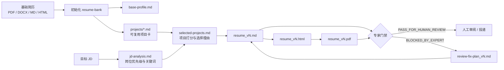
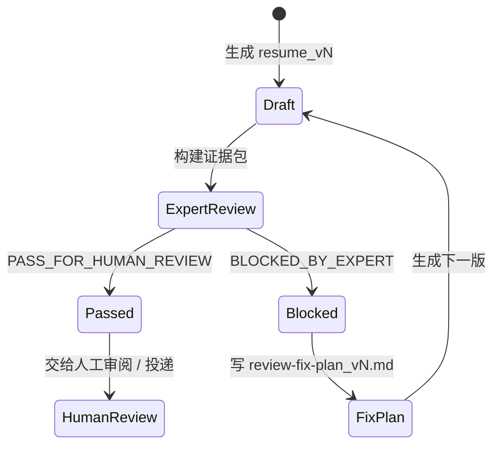
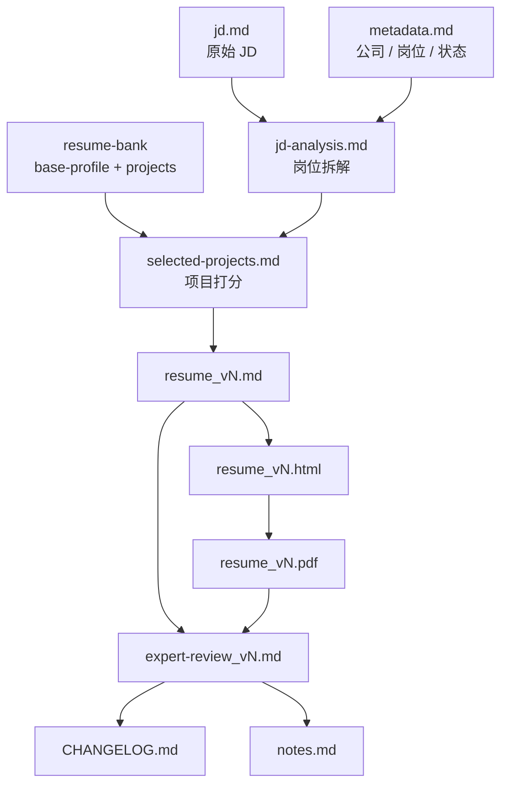
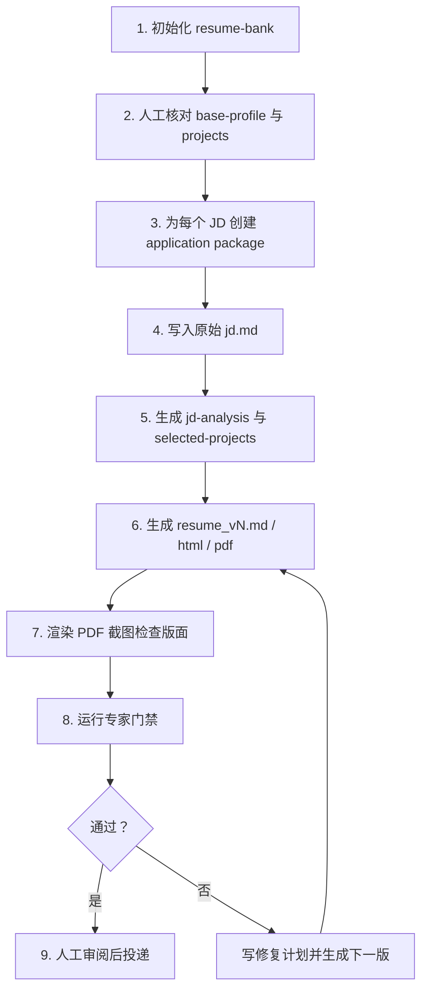

<div align="center">

# tailored-resume-generator

**把一份基础简历，变成一套可复现、可审计、可迭代的 JD 定制投递流水线。**

<p>
  
  
  
  
</p>

<p>
  <a href="#-工作流总览">工作流</a> ·
  <a href="#-快速安装">快速安装</a> ·
  <a href="#-快速上手">快速上手</a> ·
  <a href="#-专家门禁">专家门禁</a> ·
  <a href="#-事实安全原则">事实安全</a>
</p>

</div>

---

## ✨ 项目定位

`tailored-resume-generator` 是一个面向求职投递的 **Codex Skill**：从一份基础简历和可复用项目库出发，为不同 JD 生成定制简历、HTML/PDF 版本、项目筛选记录、修改历史和专家审阅结果。

它的目标不是“花式改写”，而是建立一套可复现的投递流程：

| 核心目标 | 说明 |
| --- | --- |
| 🧱 沉淀经历 | 把个人经历拆成可复用的 `resume-bank` 与项目卡 |
| 🎯 匹配 JD | 分析岗位优先级、关键词、硬性要求和风险点 |
| 🧮 选择项目 | 从项目库中筛选最相关经历，并记录选择理由 |
| 📝 生成版本 | 输出 Markdown / HTML / PDF 简历版本 |
| 🧪 专家审核 | 做版面检查、事实边界检查和专家式对抗审核 |
| ✅ 审核后投递 | 只有通过门禁后才交给人工审阅或投递 |

---

## 🧭 工作流总览



---

## 🧩 能力矩阵

| 阶段 | 输入 | 关键动作 | 主要产物 |
| --- | --- | --- | --- |
| 初始化 | 基础简历 | 抽取身份、教育、技能、经历 | `base-profile.md`、`projects/*.md`、`INIT_REVIEW.md` |
| JD 分析 | 公司 / 岗位 / JD | 拆解硬性要求、优先级、关键词 | `jd.md`、`metadata.md`、`jd-analysis.md` |
| 项目筛选 | `resume-bank` + JD | 按相关性、证据强度、风险打分 | `selected-projects.md` |
| 简历生成 | 已确认项目卡 | 生成针对岗位的简历版本 | `resume_vN.md`、`resume_vN.html`、`resume_vN.pdf` |
| 对抗审核 | 当前版本 + 证据包 | 专家式检查事实、匹配度、表达风险 | `expert-review_vN.md`、`review-fix-plan_vN.md` |
| 迭代交付 | 用户反馈 / 审核结果 | 小步修复、记录变化、不覆盖旧版 | `CHANGELOG.md`、下一版 `resume_vN+1.*` |

---

## 🗂️ 目录结构

```text
tailored-resume-generator/
├── SKILL.md
├── agents/
│   └── openai.yaml
├── assets/
│   └── resume-template.html
├── references/
│   ├── adversarial-resume-review.md
│   ├── application-package.md
│   ├── chinese-technical-resume-finalization.md
│   ├── output-contract.md
│   ├── project-card-template.md
│   └── role-fit-rubric.md
└── scripts/
    ├── create_application_package.py
    ├── generate_resume_html.py
    └── init_resume_bank.py
```

生成后的 `resume-bank` 通常长这样：

```text
resume-bank/
├── base-profile.md
├── projects/
│   └── project-id.md
├── outputs/
└── applications/
    └── YYYYMMDD-company-role/
        ├── jd.md
        ├── metadata.md
        ├── jd-analysis.md
        ├── selected-projects.md
        ├── resume_v1.md
        ├── resume_v1.html
        ├── resume_v1.pdf
        ├── expert-review_v1.md
        ├── CHANGELOG.md
        └── notes.md
```

---

## 🚀 快速安装

克隆到 Codex skills 目录：

```bash
mkdir -p ~/.codex/skills
git clone https://github.com/Hfx-J/tailored-resume-generator.git \
  ~/.codex/skills/tailored-resume-generator
```

如果你已经有同名目录，可以更新：

```bash
cd ~/.codex/skills/tailored-resume-generator
git pull
```

---

## ⚡ 快速上手

### 1. 准备基础简历

建议先准备一份已有简历，例如：

```text
/path/to/my_resume.pdf
```

然后对 Codex 说：

```text
请用 tailored-resume-generator，根据我的简历 /path/to/my_resume.pdf 初始化 resume-bank，
工作目录放在 /path/to/job-plan
```

也可以直接运行脚本：

```bash
python scripts/init_resume_bank.py \
  --resume /path/to/my_resume.pdf \
  --output /path/to/resume-bank
```

初始化后的项目卡默认需要人工核对，尤其是日期、指标、作者排序、项目边界和保密信息。

### 2. 提供 JD 生成投递包

把目标 JD 发给 Codex，例如：

```text
请基于这个 JD 生成一版简历：
〖公司〗...
〖岗位〗...
〖岗位职责〗...
〖任职要求〗...
```

也可以先创建标准投递包：

```bash
python scripts/create_application_package.py \
  --bank /path/to/resume-bank \
  --company 公司名 \
  --role 岗位名 \
  --jd-file /path/to/jd.md
```

### 3. 生成 HTML 简历

```bash
python scripts/generate_resume_html.py \
  --markdown /path/to/resume_v1.md \
  --template assets/resume-template.html \
  --output /path/to/resume_v1.html
```

### 4. 迭代修改

你可以继续给具体反馈：

```text
研究经历太短了，把论文和项目展开一点
```

```text
第一页太空，保持单栏格式但提高密度
```

```text
论文标题下面加论文链接
```

每次修改都应该生成新的版本，例如 `resume_v2.md/html/pdf`，不要覆盖已经审核过的版本。

---

## 🛡️ 专家门禁

每个 JD 定制版本在交付前都要通过对抗性专家审核。



审核专家身份会根据 JD 动态生成，例如：

| JD 方向 | 可能的专家身份 |
| --- | --- |
| 端到端自动驾驶 | 端到端自动驾驶算法负责人 |
| 多模态世界模型 | 多模态世界模型面试官 |
| SLAM / 定位 | SLAM / 定位算法负责人 |
| 机器人系统 | 机器人系统落地负责人 |

只有 `expert-review_vN.md` 中出现：

```text
PASS_FOR_HUMAN_REVIEW
```

才算可以交给人工审阅或投递。

如果结果是：

```text
BLOCKED_BY_EXPERT
```

需要写 `review-fix-plan_vN.md`，再生成下一版修复。

---

## 🎨 中文技术简历规则

针对中文算法/工程简历，默认采用保守技术风格：

| 维度 | 规则 |
| --- | --- |
| 页面 | A4，必要时两页 |
| 布局 | 单栏布局，密度要足但不能拥挤 |
| 视觉 | 白底、克制红色强调，不做花哨营销风 hero |
| 字体 | 宋体 / SimSun 风格正文 |
| 页眉 | 有照片和学校 Logo 时放在页眉 |
| 论文 | 最相关 1-2 篇作为主论文，其他放入 `补充论文成果` |
| 链接 | 有公开链接时放紧凑链接行，如 `IEEE Xplore` |

---

## 📦 Application Package 产物地图



---

## 🧪 事实安全原则

| 原则 | 示例 |
| --- | --- |
| 不编造 | 不编造公司、岗位、时间、论文、奖项、指标或工具 |
| 不升级 | 不把“了解”升级成“精通” |
| 留占位 | 缺失事实使用 `[量化指标待补]`、`[项目规模待补]` |
| 链接真实 | 未公开论文不要伪造链接 |
| 保护隐私 | 私有项目不要泄露地图、数据、客户和内部实现细节 |
| 记录边界 | 论文作者排序、收录状态和链接要写入项目卡 |

---

## ✅ 推荐工作流



---

## 🎯 适用场景

- 2027 秋招 / 校招投递
- 自动驾驶、机器人、SLAM、感知、端到端算法岗位
- 多 JD 批量定制简历
- 中文技术简历 PDF 打磨
- 论文 / 项目经历较多，需要为不同岗位重排重点的候选人

## 🚫 不适合做什么

- 不适合伪造经历或夸大项目边界
- 不适合把一份简历无脑套所有岗位
- 不适合替代人工事实核对
- 不适合公开上传含个人隐私的真实简历材料

---

## 🖼️ 后续可以补充的真实截图

当前 README 已经可以直接用 Mermaid 渲染流程图。后面如果想进一步提升观感，可以在仓库里加一个 `docs/images/` 目录：

```text
docs/images/
├── resume-bank-preview.png
├── application-package-preview.png
└── resume-pdf-preview.png
```

然后在 README 顶部加入：

```markdown

```
